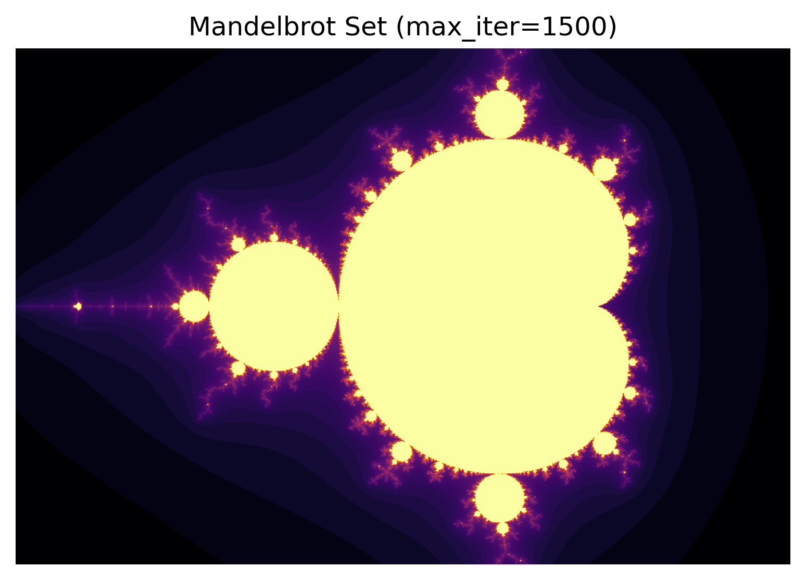
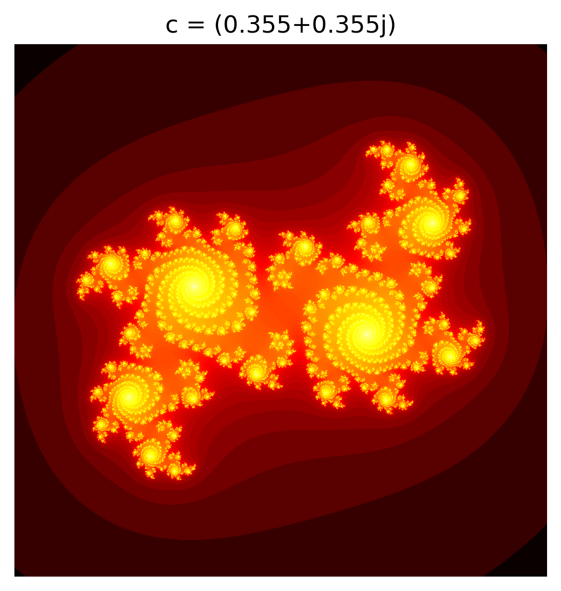

# Визуализация множеств Мандельброта и Жюлиа

## Описание

Данный проект представляет собой лабораторную работу по курсу "Теория функций комплексного переменного". В рамках работы были разработаны программы для визуализации множеств Мандельброта и Жюлиа с использованием языка программирования Python и библиотек NumPy и Matplotlib.

В результате выполнения лабораторной работы были получены изображения, которые демонстрируют фрактальные структуры этих множеств.

## Содержимое

В папке находятся следующие файлы:

- `mandelbrot_set.png` — изображение множества Мандельброта.
- `julia_set.png` — изображение множества Жюлиа.

## Техническое задание

1. **Множество Мандельброта**:
   - Напишите программу, которая будет строить визуализацию множества Мандельброта.
   - Выберите разумные ограничения и поварьируйте максимальное количество итераций.
   - Попробуйте приблизить отдельные части множества, чтобы увидеть фрактальную структуру.

2. **Множество Жюлиа**:
   - Напишите программу, которая по заданному значению `c` строит заполненное множество Жюлиа.
   - Поварьируйте максимальное количество итераций и наблюдайте фрактальную структуру.
   - Рассмотрите множество при разных значениях `c`. Например, красиво получается при `c = -0.5251993 + 0.5251993j`.

## Использование

Для запуска программ необходимо установить библиотеки NumPy и Matplotlib. Вы можете установить их с помощью pip:

```bash
pip install numpy matplotlib
```

После установки библиотек вы можете запустить скрипты, чтобы сгенерировать изображения множеств. В результате вы получите файлы `mandelbrot_set.png` и `julia_set.png` в текущей директории.

## Примеры изображений

- 
- 

## Заключение

Данный проект наглядно демонстрирует сложные и красивые структуры, возникающие в результате итеративных процессов в комплексной плоскости. Изучение множеств Мандельброта и Жюлиа углубляет понимание фракталов и их свойств в математике и теории функций комплексного переменного.
